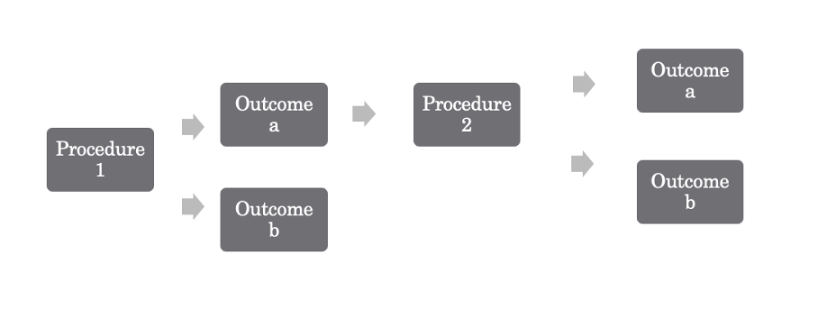

# Standard Operating Procedure for Establishing an Access Granting Process

| Title        | Version number | Effective date | Number of pages |
| --- | --- | ---- | --- |
| Insert title | #              | MM/DD/YYYY     | #               |

---------
There are five elements to this Standard Operating Procedure (SOP):

1. [Purpose](https://github.com/Roxoutthere/Roxoutthere/blob/main/SOP_Sample.md#purpose)
1. [Scope](https://github.com/Roxoutthere/Roxoutthere/blob/main/SOP_Sample.md#scope)
1. [Procedure](https://github.com/Roxoutthere/Roxoutthere/blob/main/SOP_Sample.md#procedures)
1. [Outcomes](https://github.com/Roxoutthere/Roxoutthere/blob/main/SOP_Sample.md#outcomes)
1. [References](https://github.com/Roxoutthere/Roxoutthere/blob/main/SOP_Sample.md#references)

# Purpose

This document serves to establish a process for granting access to enterprise assets.

# Scope

The instructions in this document will be followed in the situations below:

<ol type="a">
  <li>a new hire,</li>
  <li>a grant of rights, OR</li>
  <li>a user role change</li>
</ol>

# Procedures

1. Check to see if an enterprise process for granting access to enterprise assets exists.
        <ol type="a">
            <li>yes</li>
            <li>no</li>
        </ol>
2. If “a,” then check to see if the process includes, at a minimum, a way to grant access for the situations described under [Scope](https://github.com/Roxoutthere/Roxoutthere/blob/main/SOP_Sample.md#scope). For each element that is included, assign a value of 1. Add the values of the elements included.
    <ol type="a">
            <li>value >0</li>
            <li>value <0</li>
        </ol>

*Figure 1 Procedures and Outcomes, where all Outcomes "b" mean "fail"*  

# Outcomes

1. If [Procedure 1](https://github.com/Roxoutthere/Roxoutthere/blob/main/SOP_Sample.md#procedures), then:
    <ol type="a">
            <li>outcome “a” means “pass”</li>
            <li>outcome “b” means “fail”</li>
        </ol>

2. If [Procedure 2](https://github.com/Roxoutthere/Roxoutthere/blob/main/SOP_Sample.md#procedures) then:
    <ol type="a">
            <li>outcome “a” means “pass”</li>
            <li>outcome “b” means “fail”</li>
        </ol>

# References

[6.1: Establish an Access Granting Process](https://controls-assessment-specification.readthedocs.io/en/stable/control-6/control-6.1.html), CIS Controls, 2022, Revision 958d5305.
